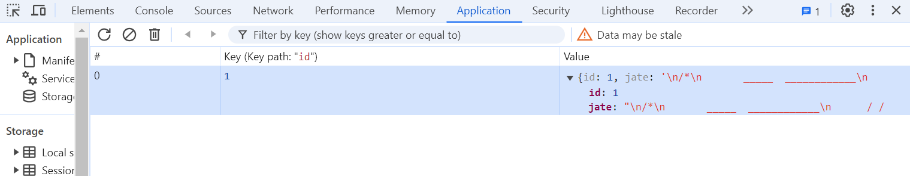

# PWA Text Editor

### A text editor created within a progressive web application framework

## Table of Contents

[Project Status](#project-status)

[Media of Application](#media-for-application)

[Purpose](#purpose)

[Installation](#installation)

[Usage](#usage)

[Credits](#credits)

[License](#license)

[Contributing](#contributing)

[Tests](#tests)

[Questions](#questions)

## Project Status

**Complete**

[GitHub Repository](https://github.com/aaguimond/module19-pwa-text-editor)

[Live PWA Text Editor](https://module19-pwa-text-editor-q8ub.onrender.com/)

## Media for Application

The application's IDB storage

The application's service worker

The application's manifest

The application running natively on a user's device

## Purpose

To increase my proficiency at developing progressive web applications.

## Installation

The application can be accessed at the [Render deployment URL](#project-status). It can be used without installing any dependencies. However, the application can be run in development mode by first cloning the repo, running "npm i" in the client, server, and root directories. Next, build the client-side assets by opening a terminal from within the client directory and running "npm run build". Finally, start the application by opening a terminal from the root directory and running "npm run start:dev". Navigate to the URL displayed in the terminal to use the application.

## Usage

Users can write code using this JATE PWA. It operates either online or offline thanks to Workbox, our service worker, our use of caching, and our APIs. The application can also be installed and run natively from a user's device.

## Credits

* Babel
* Concurrently
* Cross ENV
* CSS Loader
* Webpack
* Webpack PWA Manifest
* Webpack CLI
* Webpack Dev Server
* Webpack Workbox
* HTTP Server
* Nodemon
* Style Loader
* Express.js
* IDB

## License

This project is licensed under the [ISC](https://opensource.org/licenses/ISC) license.

## Contributing

Please feel free to use the code within the scope of the [license](#license), make pull requests, or [contact me](#questions).

## Tests

None as of yet.

## Questions

Please reach out to me with any questions:

- Github: [aaguimond@gmail.com](https://github.com/aaguimond@gmail.com)
- Email: aidanguimond2024@u.northwestern.edu